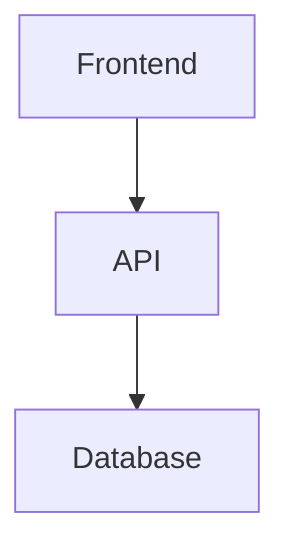
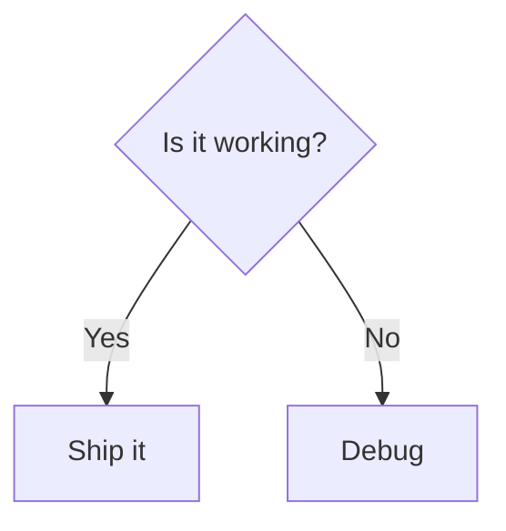
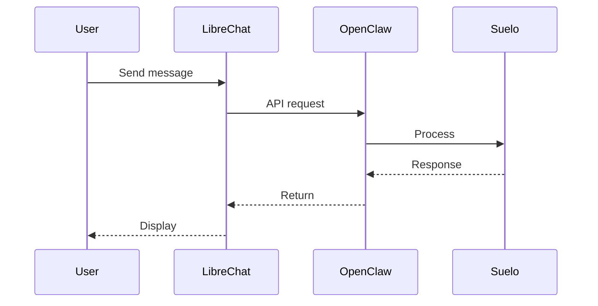

# LibreChat Artifacts - Working

## Status: ✅ FUNCTIONAL

Mermaid diagrams render correctly as interactive artifacts in LibreChat.

## Correct Format

```
:::artifact{identifier="unique-id" type="application/vnd.mermaid" title="Title"}
```mermaid
[content here]
```
:::
```

## Supported Types
- `application/vnd.mermaid` - flowcharts, diagrams ✅ TESTED
- `text/html` - html components
- `application/vnd.react` - react components
- `image/svg+xml` - svg graphics

## Use Cases (Be Proactive!)

**Use artifacts when:**
- Explaining workflows or architecture
- Visualizing data flow
- Creating diagrams of systems
- Building quick interactive prototypes
- Showing code structure
- Creating visual summaries

**Don't use when:**
- Simple text answer suffices
- Code is for copy-paste only
- One-line response

## Examples to Use

### System Architecture


### Decision Trees


### Process Flows


## Key Rule

**Always prefer artifacts over text walls when explaining complex systems.**

Visual diagrams > paragraphs of explanation
