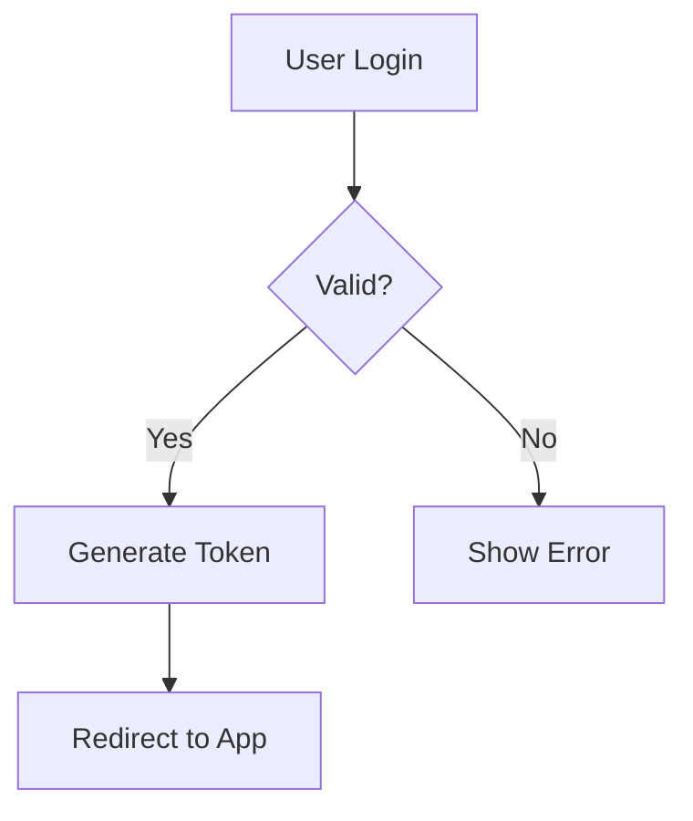

# LibreChat Artifacts Skill

Generate interactive, rendered content in LibreChat's side panel using the Artifacts feature.

## Overview

Artifacts allow creating living documents that render in a separate UI panel — not just text responses. Use these for visual explanations, interactive demos, and executable code.

## Artifact Types

| Type | MIME Type | Best For |
|------|-----------|----------|
| **Mermaid** | `application/vnd.mermaid` | Flowcharts, sequence diagrams, ER diagrams, Gantt charts, mind maps |
| **React** | `application/vnd.react` | Interactive UI components, dashboards, forms |
| **HTML** | `text/html` | Full web pages, styled content, sandpack apps |
| **SVG** | `image/svg+xml` | Vector graphics, custom illustrations, icons |

## Syntax

Use the artifact wrapper with a unique identifier:

```
:::artifact{identifier="unique-id" type="MIME_TYPE" title="Descriptive Title"}
```LANG
content here
```
:::
```

## When to Use Each Type

### Mermaid Diagrams
**Use when:** Explaining workflows, system architecture, decision trees, processes, timelines

```
:::artifact{identifier="auth-flow" type="application/vnd.mermaid" title="Authentication Flow"}

:::
```

### React Components
**Use when:** Building interactive demos, showing UI concepts, prototyping interfaces

```
:::artifact{identifier="counter-demo" type="application/vnd.react" title="Counter Component"}
```jsx
import { useState } from 'react';
import { Button } from '@/components/ui/button';

export default function Counter() {
  const [count, setCount] = useState(0);
  return (
    <div className="p-4">
      <h2 className="text-xl mb-4">Count: {count}</h2>
      <Button onClick={() => setCount(c => c + 1)}>Increment</Button>
    </div>
  );
}
```
:::
```

### HTML
**Use when:** Creating styled documents, landing pages, interactive forms

```
:::artifact{identifier="styled-card" type="text/html" title="Info Card"}
```html
<div style="padding: 20px; border-radius: 8px; background: #f0f0f0;">
  <h2 style="color: #333;">Hello World</h2>
  <p>This is a styled HTML artifact.</p>
</div>
```
:::
```

### SVG
**Use when:** Custom graphics, data visualizations, icons, illustrations

```
:::artifact{identifier="custom-icon" type="image/svg+xml" title="Custom Icon"}
```svg
<svg width="100" height="100" viewBox="0 0 100 100">
  <circle cx="50" cy="50" r="40" fill="#4CAF50" />
  <text x="50" y="55" text-anchor="middle" fill="white" font-size="20">OK</text>
</svg>
```
:::
```

## Proactive Triggers

**ALWAYS offer an artifact when the user discusses:**

1. **System design or architecture** → Mermaid flowchart/diagram
2. **Decision trees or logic** → Mermaid flowchart
3. **UI/UX ideas or components** → React or HTML artifact
4. **Data relationships** → Mermaid ER diagram
5. **Processes or workflows** → Mermaid sequence diagram
6. **Visual concepts** → SVG or HTML artifact
7. **Code that should be executable** → Code Interpreter (see below)

**Don't wait to be asked** — proactively say:
> "Want me to visualize this as a [mermaid diagram/react component/etc]?"

## Code Interpreter API

For executing code and showing output, use the Code Interpreter capability:

- **Languages:** Python, Node.js/TS, Go, C/C++, Java, PHP, Rust, Fortran, R
- **Use for:** Data analysis, calculations, file processing, testing code
- **Note:** Requires API subscription at code.librechat.ai

When enabled, the "Run Code" button appears on code blocks.

## Best Practices

1. **Use descriptive identifiers** — unique and meaningful
2. **Give clear titles** — helps user understand the artifact's purpose
3. **Offer before creating** — ask if they want a visualization first
4. **Prefer Mermaid for simple diagrams** — fastest to render
5. **Use React for interactivity** — buttons, state, user input
6. **Use HTML for styled documents** — full CSS control
7. **Combine types** — multiple artifacts in one response are fine

## Examples by Use Case

### Explaining a Process
```
User: "How does OAuth2 work?"
Action: Create Mermaid sequence diagram showing the token exchange
```

### Designing a UI
```
User: "I need a dashboard with stats"
Action: Create React component with sample data and layout
```

### Showing Data Relationships
```
User: "What's the schema for my app?"
Action: Create Mermaid ER diagram
```

### Demonstrating Logic
```
User: "How does this algorithm work?"
Action: Create HTML artifact with step-by-step visualization OR use Code Interpreter to execute and show output
```

## Common Mermaid Diagram Types

```mermaid
flowchart TD        % Flowchart (top-down)
flowchart LR        % Flowchart (left-right)
sequenceDiagram     % Sequence/timing diagrams
classDiagram        % UML class diagrams
stateDiagram        % State machines
erDiagram           % Entity relationship
gantt               % Gantt charts
pie                 % Pie charts
journey             % User journey
```
